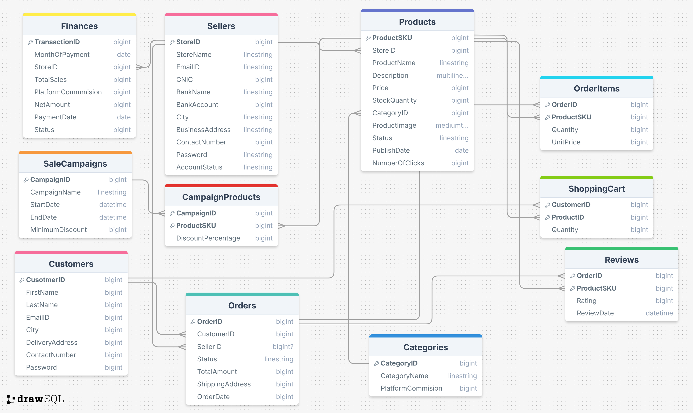

---

## Database Setup
1. **Create the Database:**
   - Open SQL Server Management Studio (SSMS).
   - Execute the `ProjDatabase.sql` file to create the schema and populate it with test data.

---

## Running the Project
Navigate to the relevant folder and run the corresponding Python file based on the module:

- **Admin Module:**
  1. Open the `Admin Handle` folder.
  2. Run the following command:
     ```bash
     python AdminCenter.py
     ```

- **Seller Module:**
  1. Open the `Seller Center` folder.
  2. Run the following command:
     ```bash
     python SellerCenter.py
     ```

- **Customer Module:**
  1. Open the `Customer Handle` folder.
  2. Run the following command:
     ```bash
     python CustomerCenter.py
     ```

---

## Notes
- The default database connection string inside the get_database_connection() function in each source code uses Windows Authentication:
  ```python
  "DRIVER={ODBC Driver 17 for SQL Server};"
  "SERVER=ZAIN_PC\\MYSQL1;"
  "DATABASE=StoreDatabase;"
  "Trusted_Connection=yes;"
  "TrustServerCertificate=yes;"
- You may change SERVER=ZAIN_PC\\MYSQL1; in accordance with your own system.

  

